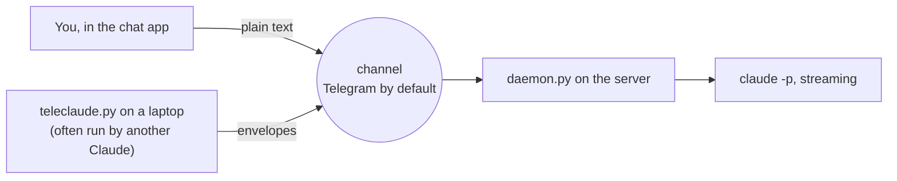

# teleclaude

A small open protocol for driving [Claude Code](https://docs.claude.com/en/docs/claude-code) on a
remote machine over a chat channel. A daemon runs on the server and turns incoming messages into
Claude Code turns. You talk to it from your phone, or another Claude talks to it from your laptop.

Telegram is the default (and so far only) channel.



## Pieces

| File | Runs on | What it is |
| --- | --- | --- |
| `daemon.py` | server | The daemon. One long-lived Claude Code process per conversation. |
| `teleclaude.py` | laptop | CLI client: sends a prompt or `/command`, prints the answer. |
| `channels.py` | both | `TeleclaudeChannelReceiver` and `TeleclaudeChannelSender`, plus the Telegram implementations. |
| `protocol.py` | both | The wire format. |
| `config.py` | both | TOML config with environment overrides. |
| `tui.py` | anywhere | Terminal UI over local Claude sessions. |
| `push-session.py` | laptop | Copies a local Claude transcript to the server for `/resume`. |
| `skills/teleclaude` | laptop | A Claude Code skill that teaches Claude when and how to use the client. |

## Channels

A channel has two ends, because messages flow one way and answers come back the other:

- **`TeleclaudeChannelReceiver`** is the daemon's end. It yields inbound messages from allowed
  senders, sends replies (optionally threaded under the message they answer), and reports a
  cursor so a restart resumes without handling anything twice.
- **`TeleclaudeChannelSender`** is the client's end. It sends text to the daemon and hands back
  whatever the daemon says.

Implementations register with `@register(RECEIVERS)` or `@register(SENDERS)` under a name, and
`channel = "<name>"` in the config picks one. The Telegram pair:

- `TelegramChannelReceiver` polls a bot over the Bot API and answers only the account it is paired with.
- `TelegramChannelSender` logs in as **your own account** over MTProto (via Telethon) and messages
  that bot. Bots cannot message other bots, and sending as you means the daemon's pairing
  already trusts the client.

## Protocol

Humans type plain text. Programs send **envelopes**, and the daemon answers each request in the
form it arrived in.

An envelope is one chat message:

```
tc1:<base85( brotli( json ) )>
```

- `tc1:` marks the message and its version.
- The JSON is minified: `i` request id, `t` text, `k` kind (`p` progress or `f` final, replies
  only), `m` set when the text continues in the next envelope.
- [Brotli](https://www.rfc-editor.org/rfc/rfc7932) compresses it losslessly. Its built-in
  dictionary is tuned for English and web text, so prose typically shrinks by half or more
  before encoding.
- Base85 keeps it printable, which chat apps require.

A client picks a random request id, sends the prompt (split into `m` parts if it is too long for
one message), prints every `p` reply for that id as progress, and stops at the first complete `f`
reply. Replies for other ids and plain messages are ignored, so several clients and a human can
share one chat.

## Setup

Needs Python 3.11+, [uv](https://docs.astral.sh/uv/) and Claude Code on the server.

### Server

1. Create a bot with [@BotFather](https://t.me/BotFather).
2. Clone this repo, then copy `config.example.toml` to `~/.config/teleclaude/config.toml`, fill
   in `telegram.bot_token`, and `chmod 600` it.
3. `uv run daemon.py`, then message the bot. The first sender is paired and everyone else is ignored.
4. To keep it running, fill in and install `teleclaude.service`:

       sudo install -m 644 teleclaude.service /etc/systemd/system/
       sudo systemctl daemon-reload
       sudo systemctl enable --now teleclaude

### Laptop

1. Clone this repo to `~/teleclaude`.
2. Get an `api_id` and `api_hash` from [my.telegram.org/apps](https://my.telegram.org/apps).
3. Put them, plus `telegram.bot_username`, in `~/.config/teleclaude/config.toml`.
4. `uv run ~/teleclaude/teleclaude.py login` once, in a real terminal. The session file it saves
   is full access to your Telegram account, so it is written `0600`.
5. Try it: `uv run ~/teleclaude/teleclaude.py ask /pwd`
6. Let Claude use it: `ln -s ~/teleclaude/skills/teleclaude ~/.claude/skills/teleclaude`

## Commands

Any plain message is a Claude turn in the daemon's current directory. Tool calls stream back as
short narrated lines, then the answer arrives as a reply to your message.

- `/new` fresh conversation
- `/cd <path>` change directory (fresh conversation)
- `/resume <id>` adopt a transcript copied over with `push-session.py`
- `/pwd` directory, session, busy and timeout state
- `/stop` kill the running turn (plain "stop" works too)
- `/model [name]` list models or switch
- `/debug [on|off]` raw tool input instead of narration
- `/patient [on|off|auto]` force the long-wait pace, or detect it
- `/timeout [on|off]` turn the no-progress timeout off, or back on
- `/diff [path]`, `/clean [--only-show]` optional, see the config
- `/upgrade` run the tests, preflight the edited daemon, restart onto it
- `/help`

### Timeouts

A turn times out only when it stops making progress. Progress means a tool call or remark unlike
the recent ones, so a loop re-running the same commands counts as stuck while real work never does.

- 15 minutes without progress, normally.
- An hour while the prompt or the current tool call waits on something slow: CI, a deploy, a
  build, a watch or sleep loop.
- Never, after `/timeout off`, until `/timeout on`.

## Updating the daemon from a chat

Ask Claude for the change in a normal message, then send `/upgrade`. It runs the test suite and
boots the edited daemon under `uv` to prove it imports and reaches the channel. Either check
failing leaves the running daemon untouched. Both passing restarts in place, keeping the
conversation, directory, model and debug flag.

## Tests

    uv run --with brotli --with httpx --with telethon --with textual \
      --with pytest --with pytest-asyncio --with pytest-mock pytest -q

## Security

The daemon runs Claude with `--dangerously-skip-permissions` by default, because nothing on a phone
can answer a permission prompt. Anyone who can message it as the paired account can run commands
on the server. Keep the bot token, the config and the client session file private.

## License

MIT
